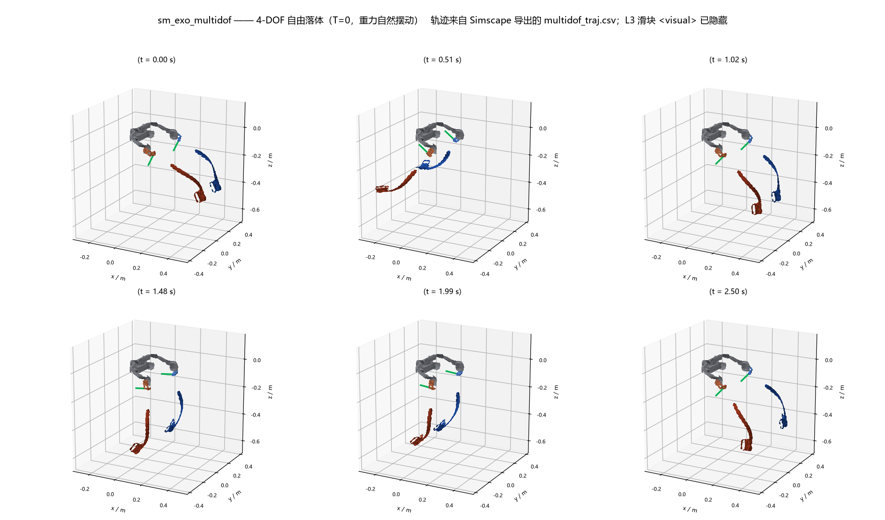
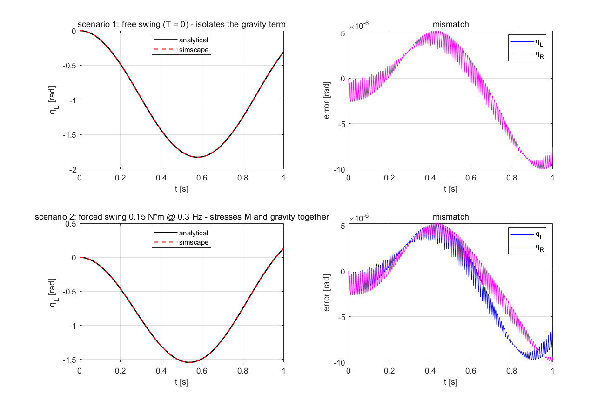

# 髋关节外骨骼 · 动力学建模（CAD → Simscape Multibody）

把**自己设计的外骨骼 CAD 装配体**做成可仿真的多刚体模型，并跑通
**CAD → 质量属性 → URDF → Simscape Multibody ↔ 解析动力学** 整条链路。

- **动力学**：拉格朗日刚体动力学 `M(q)q̈ + C(q,q̇)q̇ + G(q) = Q_ext`，关节力矩用滑窗估计
  （公式形式沿用论文；本仓库只做自己模型的建模与链路打通）。
- **自由度**：**4 DOF** —— 左右腿各 2 个转动关节（`hip` 髋屈伸 + `abduct` 腿部横向内收外展）。
- **结果**：Simscape 与解析两条**互相独立**的实现，末态偏差 **1e-08 量级** 一致。

---

## 模型


真实装配体 STEP 导出的可视化网格（髋部固定段 + 左右腿各 3 段）。
`<inertial>` 惯性参数与图里的 `<visual>` 网格**同源**——都来自 STEP 的体积积分，
所以**你在图上看到的几何，就是动力学里用的几何**。

## 自由度与位姿


每腿 2 个转动自由度：

| 关节 | 含义 | 轴 |
|---|---|---|
| `hip` | 髋关节屈伸 | ∥ 全局 Y 轴 |
| `abduct` | 腿部横向内收 / 外展 | ⊥ 髋轴（沿腿纵向摆） |

第 3 段的导轨滑块行程只有 **2 mm**（装配间隙），按固定关节处理，不建模为自由度。

## 运动仿真

`T = 0` 自由落体，重力自然驱动，4 个自由度全部被激励：




---

## 质量属性

模型的质量 / 惯量全部由 **CAD 几何体积 × 密度表** 推出（`exo2609/geometry.py`），不依赖实物称重。

| 段 | 质量 (kg) |
|---|---|
| 髋部固定段 `base` | 2.7043 |
| 左腿（L1 电机输出段 + L2 腿杆段 + L3 滑块段） | 0.3126 |
| 右腿（镜像） | 0.3126 |
| **整机** | **3.3295** |

单腿按零件拆开（19 种零件 / 35 件实例，实例加权口径 312.75 g）：

| 零件 | 质量 (g) | 占比 | 密度依据 |
|---|---|---|---|
| 电机_出轴 | 96.89 | 30.98% | 钢 7850 |
| 腿部_腿杆_片状V5 | 87.13 | 27.86% | 铝 2700 ⚠️兜底 |
| 腿部_绑缚 | 28.54 | 9.13% | 尼龙 1150 |
| 腿部_滑块_双键 | 26.10 | 8.35% | 铝 2700 ⚠️兜底 |
| 其余 15 种 | 74.09 | 23.68% | — |
| **合计** | **312.75** | 100% | |

> ⚠️ **密度是唯一软假设**。密度表按零件名映射（精确名 → 关键字 → 默认铝 2700）。
> 单腿 19 种零件里 **8 种落兜底**，占腿质量 **52%**。最大的兜底件 `腿部_腿杆_片状V5`（27.9%）
> 若其实是钢，单腿质量会 **+53%**。
> ⇒ 这批数字的**精度上限由称重决定，不由算法决定**（称重清单见 `matlab2609/solidworks/`）。

---

## 链路一致性验证

同一条轨迹，两条独立实现互相对照：

| 对照 | 指标 | 结果 |
|---|---|---|
| **4-DOF**（4818 点 / 2.5 s 自由落体） | 最差通道 `abduct_L` 的 rms/range | **1.94e-06** ✅（阈值 1e-2） |
| **2-DOF** | 最差 rms/range | **2.95e-06** ✅ |
| **拆段回归**（4-DOF 锁死 `abduct` vs 2-DOF） | 末态最大差 | **1.023e-08** ✅ |

`abduct` 摆幅 **0.407 / 0.428 rad**（不接近 0）——说明第 4 个自由度**确实被激励**，
不是退化成了 2-DOF 的假对照。




---

## 目录结构

```
exo2609/            Python 侧：几何 / 质量属性 + 解析动力学
matlab2609/         MATLAB 侧：Simscape Multibody + 解析孪生 + 文档
  simscape/         URDF、导入脚本、harness、对照脚本、plant_*.json
  solidworks/       质量预算 / 称重清单
dynamics_model/     早期 STEP 解析与双髋动力学探索
docs/assets/        README 展示用图与 GIF
```

## 复现

```bash
# 几何 → 质量属性 → 4-DOF 解析动力学 → 与 Simscape 轨迹对照
python _multidof_compare.py
```

```matlab
% MATLAB 侧：URDF → Simscape → harness → 与解析对照
cd matlab2609/simscape
rerun_after_density      % 一键重放全部基线，末尾打印 RERUN_ALL_OK
```

> ⚠️ URDF 是 Simscape 模型参数的唯一来源，而 `smimport` 会把块参数**烤进 `.slx`**；
> 改密度表 / URDF 后必须**重跑 `smimport`**（即跑上面的 `rerun_after_density`），
> 只重生成 URDF 是不够的。`-sd` 必须指到 `matlab2609/simscape`（URDF 里 STL 用相对路径）。

## 关于 CAD

本仓库只放**代码 + 文档 + 报告**，CAD 源文件（`.SLDPRT`/`.SLDASM`）、STL 网格、
`.slx` 模型与生成图均不入库（见 `.gitignore`）；`docs/assets/` 下是 README 展示用的少量图片与 GIF。
