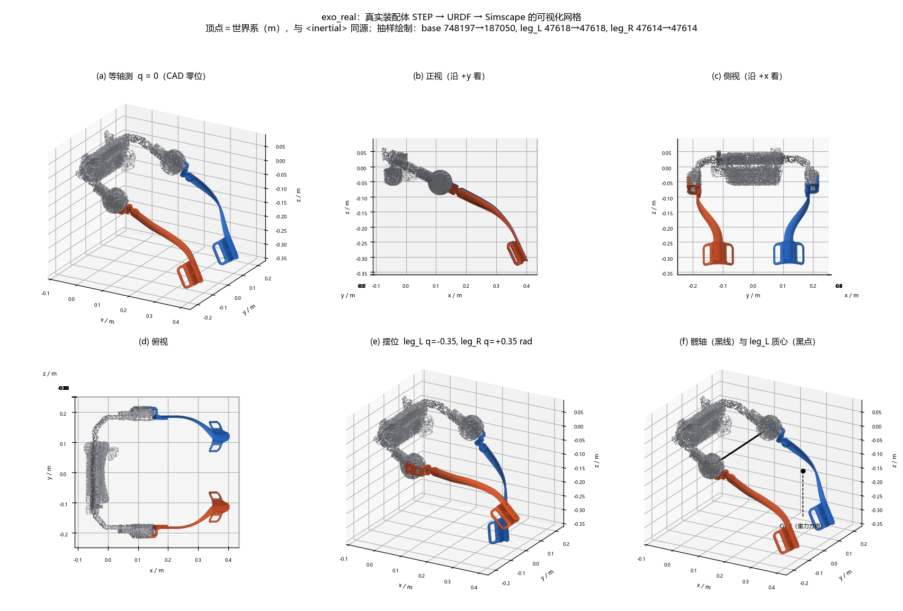
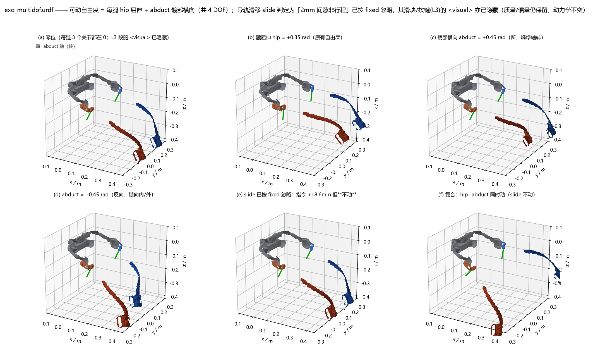
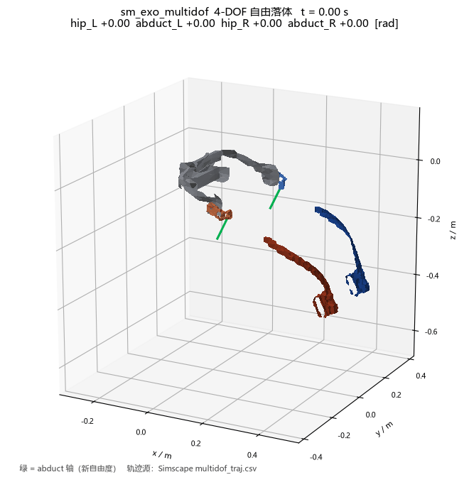
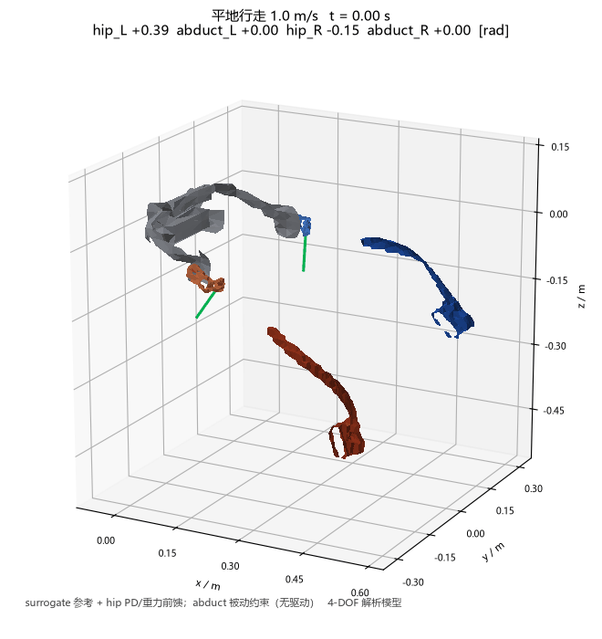
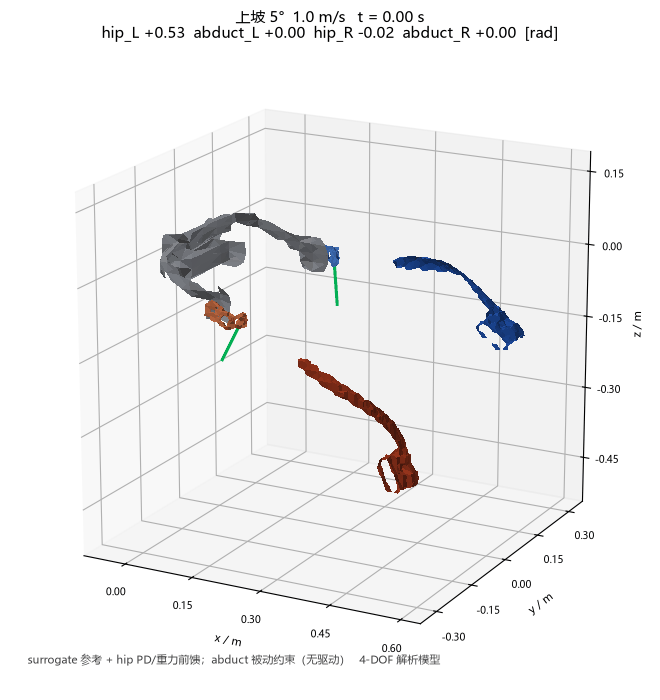
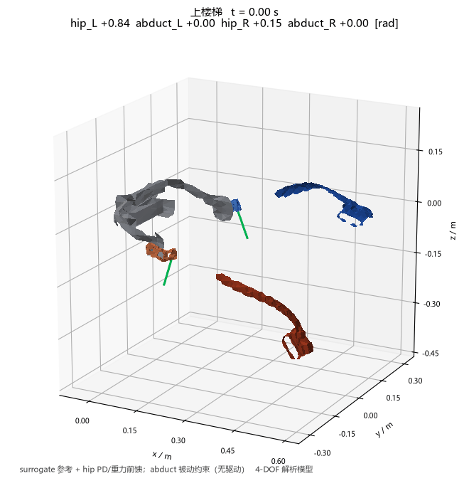
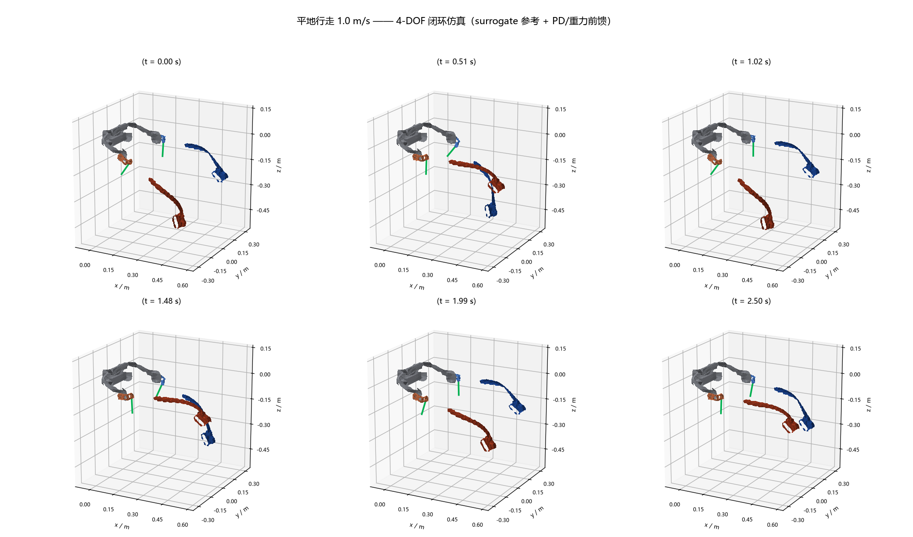
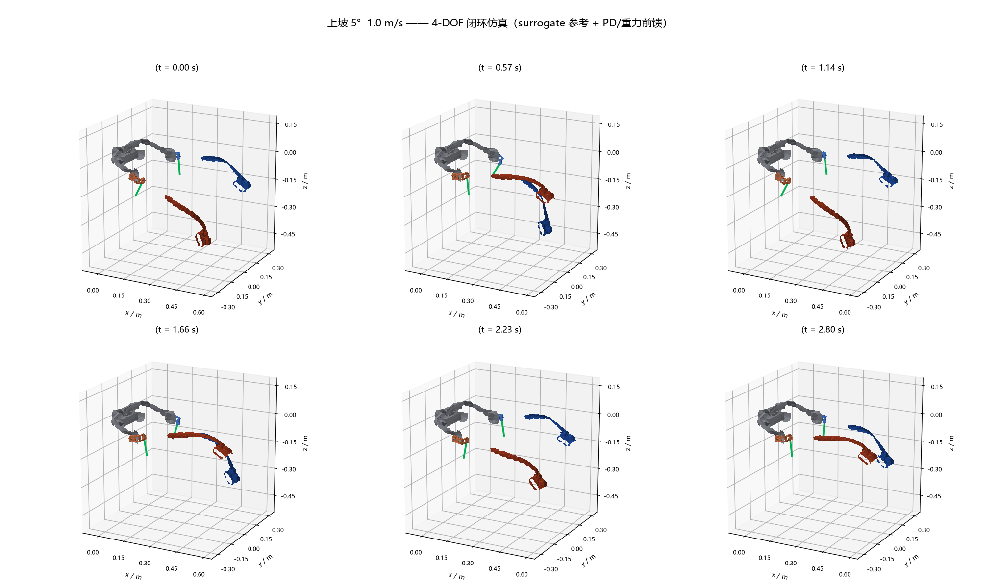
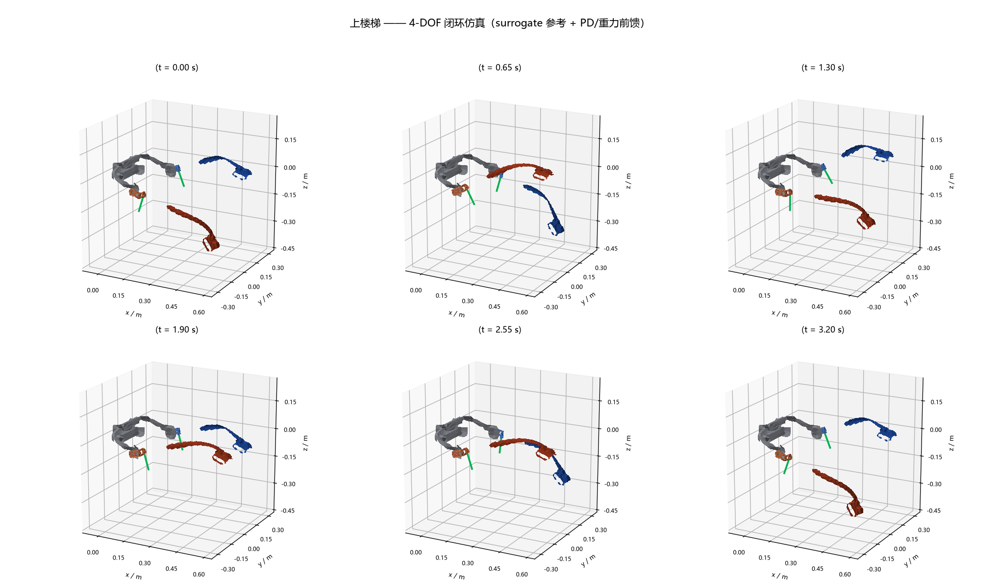
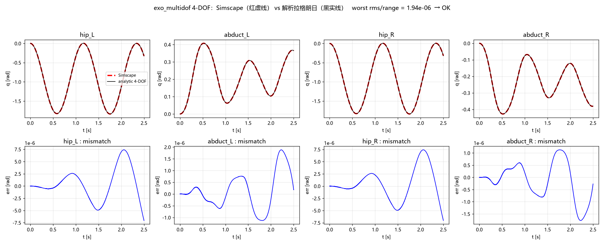

# 髋关节外骨骼 · 动力学建模（STEP → Simscape Multibody）

把外骨骼的 **STEP 装配体**做成可仿真的多刚体模型，跑通
**STEP(.stp) → 几何/质量属性 → URDF → Simscape Multibody ↔ 解析动力学** 整条链路。

- **动力学**：拉格朗日刚体动力学 `M(q)q̈ + C(q,q̇)q̇ + G(q) = Q_ext`，关节力矩用滑窗估计
  （公式形式沿用论文；本仓库只做自己模型的建模与链路打通）。
- **自由度**：**4 DOF** —— 左右腿各 2 个转动关节（`hip` 髋屈伸 + `abduct` 腿部横向内收外展）。
- **结果**：Simscape 与解析两条**互相独立**的实现，末态偏差 **1e-08 量级** 一致。

---

## 模型



直接从 `.stp` 装配体生成的可视化网格（髋部固定段 + 左右腿各 3 段）。
`<inertial>` 惯性参数与图里的 `<visual>` 网格**同源**——都来自同一个 STEP 的体积积分，
所以**你在图上看到的几何，就是动力学里用的几何**。

## 自由度与位姿



每腿 2 个转动自由度：

| 关节 | 含义 | 轴 |
|---|---|---|
| `hip` | 髋关节屈伸 | ∥ 全局 Y 轴 |
| `abduct` | 腿部横向内收 / 外展 | ⊥ 髋轴（沿腿纵向摆） |

## 运动仿真

### 4-DOF 自由落体

`T = 0` 自由落体，重力自然驱动（`abduct` 摆幅 **0.407 / 0.428 rad**）：



### 三个典型工况

对齐论文里的三个结构化任务（平地 / 上坡 5° / 上楼梯），驱动方式为
**髋关节 PD + 重力前馈** `Q_hip = G_hip + Kp·e + Kd·ė`；`abduct` 无主动驱动，
带被动约束 `-K_abd·q - C_abd·q̇`：

| 工况 | 步频 (Hz) | `hip` 摆幅 (rad) | `abduct` 摆幅 (rad) | 跟踪 RMS (rad) | \|τ\| 峰值 (N·m) |
|---|---|---|---|---|---|
| 平地行走 1.0 m/s | 0.89 | 0.714 | 0.024 | 0.0198 | 0.774 |
| 上坡 5° 1.0 m/s | 0.80 | 0.708 | 0.024 | 0.0163 | 0.745 |
| 上楼梯 | 0.62 | 0.935 | 0.035 | 0.0134 | 0.722 |

**平地行走 1.0 m/s**



**上坡 5° 1.0 m/s**



**上楼梯**



关键帧总览：

| 平地 | 上坡 5° | 上楼梯 |
|---|---|---|
|  |  |  |

> 口径：地形**不进入模型**（无接触 / 足底反力），上坡与上楼的差别只体现在**髋关节参考轨迹**
> （屈髋更大、更偏屈曲、步频更低）；参考轨迹是 2 阶谐波 Fourier 拟合的 surrogate，非实测。

---

## 质量属性

| 段 | 质量 (kg) |
|---|---|
| 髋部固定段 `base` | 2.7043 |
| 左腿（L1 电机输出段 + L2 腿杆段 + L3 滑块段） | 0.3126 |
| 右腿（镜像） | 0.3126 |
| **整机** | **3.3295** |

单腿按零件拆开（19 种零件 / 35 件实例，实例加权口径 312.75 g）：

| 零件 | 质量 (g) | 占比 | 密度依据 |
|---|---|---|---|
| 电机_出轴 | 96.89 | 30.98% | 钢 7850 |
| 腿部_腿杆_片状V5 | 87.13 | 27.86% | 铝 2700 |
| 腿部_绑缚 | 28.54 | 9.13% | 尼龙 1150 |
| 腿部_滑块_双键 | 26.10 | 8.35% | 铝 2700 |
| 其余 15 种 | 74.09 | 23.68% | — |
| **合计** | **312.75** | 100% | |

---

## 链路一致性验证

同一条轨迹，两条独立实现互相对照：

| 对照 | 指标 | 结果 |
|---|---|---|
| **4-DOF**（4818 点 / 2.5 s 自由落体） | 最差通道 `abduct_L` 的 rms/range | **1.94e-06** ✅（阈值 1e-2） |
| **拆段回归**（锁死 `abduct` 后对照） | 末态最大差 | **1.023e-08** ✅ |



---

## 目录结构

```
exo2609/            STEP 解析：几何 / 质量属性 + 解析动力学
matlab2609/         Simscape Multibody 侧
  simscape/         URDF、导入脚本、harness、对照脚本、plant_*.json
  solidworks/       质量预算 / 称重清单
dynamics_model/     早期 STEP 解析与双髋动力学探索
forensics/          取证探针与原始报告（step / joints / mass / solidworks / tools）
papers/             参考文献（建模公式来源那篇已入库）
docs/assets/        README 展示用图与 GIF
```
